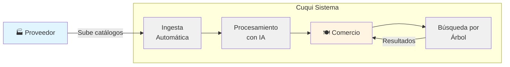
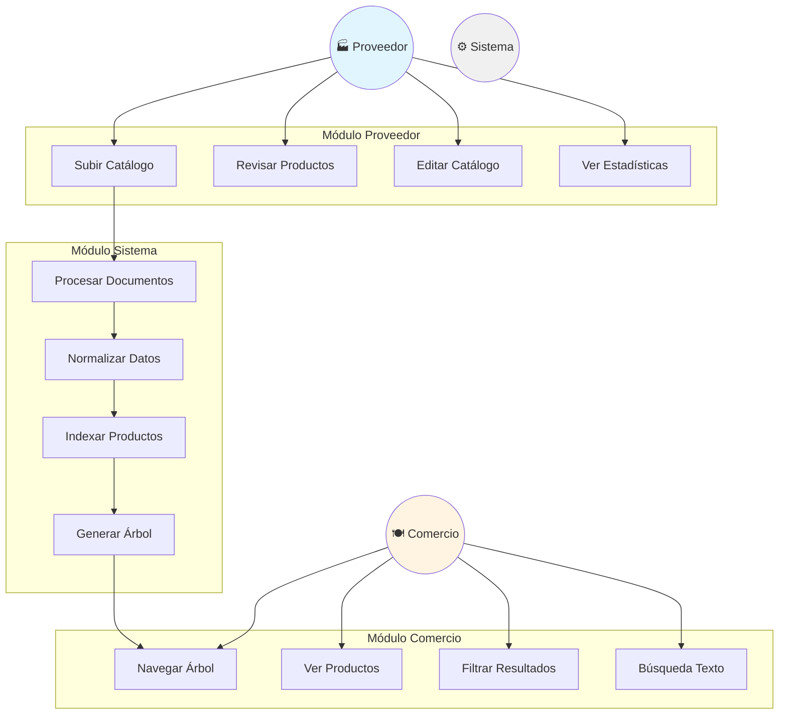
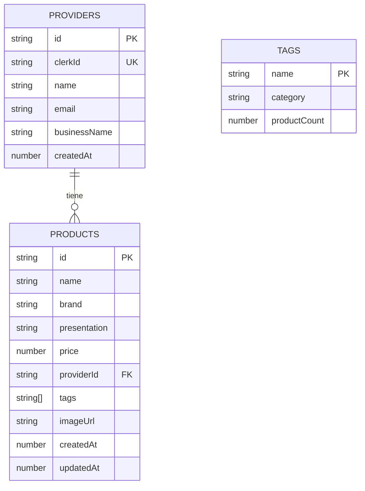
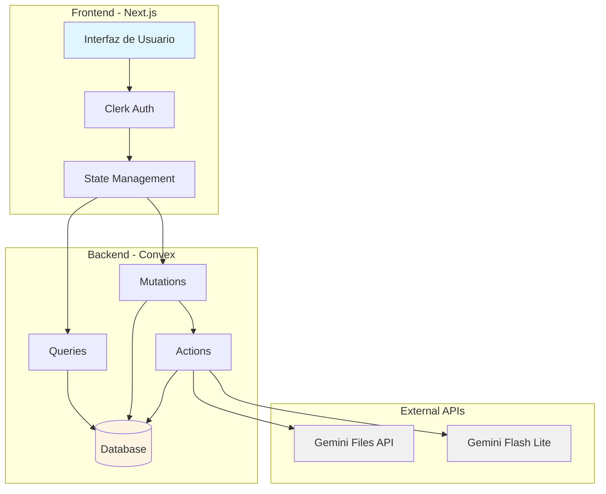
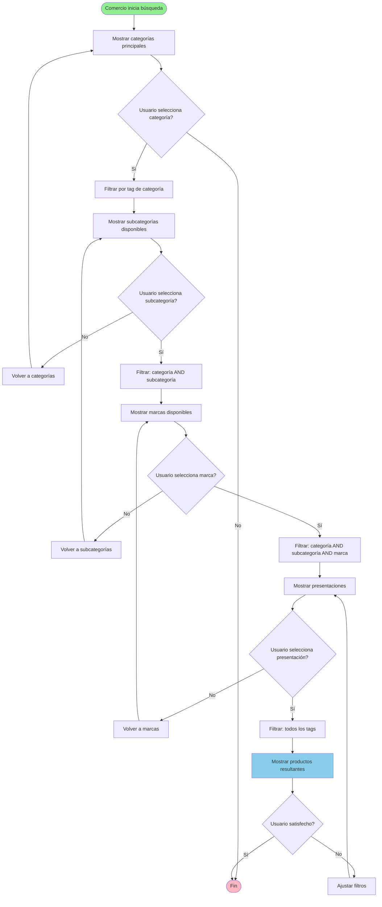

# SRS v1.1 - Cuqui: Sistema de Catálogo B2B de Alimentos

**Versión**: 1.1
**Fecha**: 25 de Marzo de 2026
**Estado**: Borrador para Aprobación
**Estándar**: IEEE 830-1998

---

## 1. Introducción

### 1.1 Propósito del Documento

Este documento tiene como propósito definir de manera completa y precisa los requisitos funcionales y no funcionales del sistema **Cuqui v1.0**, una plataforma B2B de catálogo de alimentos que conecta proveedores con comercios mediante la automatización de la ingesta y procesamiento de datos mediante Inteligencia Artificial.

Este SRS servirá como:
- Referencia única para el equipo de desarrollo
- Base para la arquitectura del sistema
- Documento de trazabilidad para pruebas y validación
- Contrato de alcance entre stakeholders y desarrolladores

### 1.2 Alcance del Sistema

**Cuqui v1.0** es un sistema de catálogo y búsqueda B2B que permite:

**INCLUIDO EN ALCANCE v1.0:**
- Ingesta automática de catálogos de proveedores en múltiples formatos (PDF, Excel, WhatsApp)
- Procesamiento y normalización de datos mediante Gemini Files API y Gemini Flash Lite
- Búsqueda de productos mediante navegación por árbol progresivo
- Sistema de tags con lógica AND para filtrado dinámico
- Gestión de catálogos por parte de proveedores
- Búsqueda intuitiva para comercios

**EXCLUIDO DEL ALCANCE v1.0 (para v2.0):**
- Transacciones comerciales
- Pasarela de pagos
- Gestión de órdenes de compra
- Comisiones por transacción
- Sistema de calificaciones y reseñas

### 1.3 Definiciones, Acrónimos y Abreviaturas

| Término | Definición |
|---------|------------|
| **SRS** | Software Requirements Specification (Especificación de Requisitos de Software) |
| **B2B** | Business to Business (Comercio entre empresas) |
| **IA** | Inteligencia Artificial |
| **MVP** | Minimum Viable Product (Producto Mínimo Viable) |
| **SaaS** | Software as a Service (Software como Servicio) |
| **Tag** | Etiqueta de clasificación asignada a un producto |
| **Normalización** | Proceso de convertir datos heterogéneos a un formato estándar estructurado |
| **Árbol progresivo** | Sistema de navegación que aplica filtros secuenciales con lógica AND |
| **Precio normalizado** | Precio por unidad de medida estándar (litro, kg, unidad) |
| **RF** | Requisito Funcional |
| **RNF** | Requisito No Funcional |

### 1.4 Referencias

1. **IEEE Std 830-1998**: IEEE Recommended Practice for Software Requirements Specifications
2. **Pressman, Roger**: Ingeniería del software: un enfoque práctico. 7a ed. McGraw Hill, 2010
3. **Vazquez, C. & Simoes, G.**: Ingeniería de Requisitos: Software Orientado al Negocio. 2018
4. **Next.js Documentation**: https://nextjs.org/docs
5. **Convex Documentation**: https://docs.convex.dev
6. **Clerk Authentication**: https://clerk.com/docs
7. **Gemini API**: https://ai.google.dev/docs

### 1.5 Resumen del Resto del Documento

El presente documento está organizado de la siguiente manera:

- **Sección 2**: Descripción general del sistema, perspectivas, funciones y características
- **Sección 3**: Requisitos funcionales detallados por actor
- **Sección 4**: Requisitos no funcionales (performance, seguridad, usabilidad, etc.)
- **Sección 5**: Requisitos de interfaces externas
- **Sección 6**: Requisitos del sistema (hardware y software)
- **Sección 7**: Requisitos del negocio
- **Sección 8**: Apéndices con glosario, diagramas y **GUÍA DE IMPLEMENTACIÓN V1.1**
- **Sección 9**: Referencias de implementación

---

## 2. Descripción General

### 2.1 Perspectiva del Producto

Cuqui es un sistema **SaaS B2B** basado en web que opera bajo una arquitectura de tres capas:

1. **Capa de Presentación** (Next.js 16 + React 19):
   - Interfaz web responsive
   - Componentes shadcn/ui
   - Tablas con TanStack React Table

2. **Capa de Lógica de Negocio** (Convex):
   - Gestión de datos en tiempo real
   - Queries, mutations y actions
   - Autenticación con Clerk

3. **Capa de Procesamiento de IA** (Gemini):
   - Gemini Files API: Procesamiento de documentos
   - Gemini Flash Lite: Normalización y extracción de datos

El sistema es **autocontenido** y no depende de otros sistemas externos para su operación principal, excepto los servicios de autenticación (Clerk) e IA (Gemini).

### 2.2 Funciones del Producto

#### 2.2.1 Funciones Principales

| ID | Función | Descripción |
|----|---------|-------------|
| F-01 | Ingesta de Documentos | Proveedores cargan catálogos en PDF, Excel, texto |
| F-02 | Procesamiento Automático | IA extrae y normaliza datos estructurados |
| F-03 | Asignación de Tags | Sistema categoriza productos automáticamente |
| F-04 | Navegación por Árbol | Comercios filtran progresivamente por categorías |
| F-05 | Búsqueda Dinámica | Árbol se genera de productos disponibles |
| F-06 | Gestión de Catálogo | Proveedores editan y actualizan productos |
| F-07 | Visualización de Productos | Comercios ven detalles completos |

#### 2.2.2 Flujo de Datos Principal

```
[Proveedor] → Sube Documento → [Gemini Files API]
                                ↓
                        [Gemini Flash Lite]
                        (Extracción + Normalización)
                                ↓
                        [Sistema de Tags]
                        (Asignación automática)
                                ↓
                        [Convex DB]
                        (Indexación)
                                ↓
[Comercio] → Navega Árbol → [Filtro AND Progresivo]
                                ↓
                        [Resultados]
```

### 2.3 Características de los Usuarios

#### 2.3.1 Usuario Tipo 1: Proveedor

**Perfil:**
- Dueño de distribuidora de alimentos
- Empleado de categoría de productos alimenticios
- Gestor de inventario de empresa proveedora

**Características:**
- Nivel técnico: Bajo a medio
- Busca: Ahorrar tiempo en carga de catálogos
- Necesita: Visibilidad de sus productos
- Frecuencia de uso: Semanal a mensual (actualizaciones)

**Permisos:**
- Subir catálogos
- Revisar productos normalizados
- Editar catálogo
- Ver estadísticas de visibilidad

#### 2.3.2 Usuario Tipo 2: Comercio

**Perfil:**
- Jefe de cocina de restaurante
- Dueño de negocio gastronómico
- Comprador de hotel o catering

**Características:**
- Nivel técnico: Bajo
- Busca: Encontrar productos rápidamente
- Necesita: Comparar opciones disponibles
- Frecuencia de uso: Diaria

**Permisos:**
- Navegar árbol de búsqueda
- Ver productos
- Filtrar resultados
- (NO puede editar productos)

### 2.4 Limitaciones

#### 2.4.1 Limitaciones Técnicas
- **Tamaño máximo de archivo**: 50 MB por documento (límite de Gemini Files API)
- **Formatos soportados**: PDF, XLSX, XLS, TXT, imágenes de WhatsApp
- **Tiempo de procesamiento**: Máximo 30 segundos por documento
- **Concurrentes**: Hasta 100 proveedores procesando documentos simultáneamente

#### 2.4.2 Limitaciones de Negocio
- **Geografía**: Solo disponible en Argentina (MVP v1.0)
- **Idioma**: Español únicamente
- **Categorías**: Solo productos alimenticios
- **Roles**: Solo proveedores y comercios (sin administradores en v1.0)

### 2.5 Suposiciones y Dependencias

#### 2.5.1 Suposiciones
1. Los proveedores tienen sus catálogos en formato digital
2. Los documentos tienen estructura reconocible (tablas, listas)
3. Los comercios tienen conexión a internet estable
4. Los productos tienen atributos estandarizables (nombre, marca, presentación)
5. Los tags pueden derivarse del contenido de los productos

#### 2.5.2 Dependencias Externas
| Servicio | Propósito | Criticalidad |
|----------|-----------|--------------|
| **Vercel** | Hosting de Next.js | Alta |
| **Convex** | Backend + Database | Alta |
| **Clerk** | Autenticación | Alta |
| **Gemini Files API** | Procesamiento de documentos | Alta |
| **Gemini Flash Lite** | Normalización con IA | Alta |

---

## 3. Requisitos Funcionales

### 3.1 Actor: Proveedores

#### RF-001: Carga de Catálogos

**Prioridad**: Esencial
**Descripción**: El sistema debe permitir a los proveedores cargar catálogos en múltiples formatos.

**Entradas**:
- Archivo en formato PDF, XLSX, XLS, TXT o imagen
- Identificación del proveedor (autenticado)

**Proceso**:
1. Proveedor selecciona archivo desde su dispositivo
2. Sistema valida formato y tamaño (< 50 MB)
3. Sistema sube archivo a Gemini Files API
4. Sistema muestra estado de carga

**Salidas**:
- Confirmación de carga exitosa
- Identificador del documento

**Criterios de Aceptación**:
- ✓ Soporta PDF, XLSX, XLS, TXT, JPG, PNG
- ✓ Rechaza archivos mayores a 50 MB
- ✓ Muestra barra de progreso de carga
- ✓ Permite cancelar carga en progreso

---

#### RF-002: Visualización del Estado de Procesamiento

**Prioridad**: Esencial
**Descripción**: El sistema debe mostrar el estado del procesamiento del documento en tiempo real.

**Estados posibles**:
1. `CARGADO` - Archivo recibido
2. `PROCESANDO` - IA está analizando
3. `NORMALIZANDO` - Extrayendo datos
4. `COMPLETADO` - Productos listos
5. `ERROR` - Falló procesamiento

**Criterios de Aceptación**:
- ✓ Actualización en tiempo real (WebSocket)
- ✓ Muestra cantidad de productos extraídos
- ✓ Tiempo estimado de finalización
- ✓ Permite reintentar si hay error

---

#### RF-003: Revisión y Edición de Productos Normalizados

**Prioridad**: Condicional
**Descripción**: El sistema debe permitir al proveedor revisar y editar los productos extraídos por la IA antes de publicarlos.

**Funciones**:
- Ver tabla con productos extraídos
- Editar cualquier campo (nombre, marca, presentación, precio)
- Eliminar productos incorrectos
- Agregar productos faltantes
- Confirmar y publicar catálogo

**Criterios de Aceptación**:
- ✓ Tabla con TanStack React Table
- ✓ Edición inline de campos
- ✓ Validación con Zod antes de guardar
- ✓ Botón "Publicar todo" batch

---

#### RF-004: Gestión de Catálogo

**Prioridad**: Esencial
**Descripción**: El sistema debe permitir gestionar el catálogo de productos activo.

**Operaciones**:
- Actualizar precio de producto individual
- Actualizar precio de productos en lote
- Desactivar producto (temporalmente agotado)
- Reactivar producto
- Eliminar producto (permanentemente)

**Criterios de Aceptación**:
- ✓ Historial de cambios de precio
- ✓ Confirmación antes de eliminar
- ✓ Exportar catálogo a Excel
- ✓ Buscar producto por nombre o código

---

#### RF-005: Visualización de Estadísticas

**Prioridad**: Optativo
**Descripción**: El sistema debe mostrar métricas de visibilidad de los productos del proveedor.

**Métricas**:
- Total de productos activos
- Productos más vistos (top 10)
- Búsquedas donde aparecen los productos
- Última actualización de catálogo

**Criterios de Aceptación**:
- ✓ Dashboard con gráficos simples
- ✓ Filtro por rango de fechas
- ✓ Exportar reporte a PDF

---

### 3.2 Actor: Comercios (Jefes de Cocina)

#### RF-006: Búsqueda por Árbol Progresivo

**Prioridad**: Esencial
**Descripción**: El sistema debe proveer una interfaz de navegación por árbol que permite filtrar productos progresivamente.

**Mecanismo**:
1. Usuario ve categorías principales (ej: Lácteos, Carnes, Panificados)
2. Selecciona "Lácteos" → sistema filtra productos con tag "lacteos"
3. Sistema muestra subcategorías disponibles (ej: Leches, Yogures, Quesos)
4. Usuario selecciona "Leches" → filtra "lacteos" AND "leches"
5. Sistema muestra marcas disponibles (ej: Serenísima, La Serenísima, SanCor)
6. Usuario selecciona marca → filtra "lacteos" AND "leches" AND "serenísima"
7. Sistema muestra presentaciones (ej: 1L, 5L)
8. Usuario selecciona presentación → filtra todos los tags anteriores

**Criterios de Aceptación**:
- ✓ Cada nivel muestra SOLO opciones disponibles
- ✓ Permite retroceder al nivel anterior
- ✓ Muestra cantidad de productos en cada opción
- ✓ Breadcrumb de navegación (ej: Lácteos > Leches > Serenísima > 5L)

---

#### RF-007: Navegación Dinámica

**Prioridad**: Esencial
**Descripción**: El árbol debe generarse dinámicamente basándose en los productos disponibles en la base de datos.

**Regla**:
Si no hay productos con el tag "san-cor", esa marca NO aparece en las opciones de marcas.

**Ejemplo**:
```
Productos en BD:
- Producto A: tags = ["lacteos", "leches", "serenísima", "5l"]
- Producto B: tags = ["lacteos", "leches", "serenísima", "1l"]

Árbol generado:
Nivel 1: [Lácteos]
Nivel 2: [Leches]
Nivel 3: [Serenísima]
Nivel 4: [5L, 1L]

Si NO hubiera productos Serenísima, el nivel 3 estaría VACÍO.
```

**Criterios de Aceptación**:
- ✓ Opciones se calculan en tiempo real
- ✓ Sin productos = sin opciones en ese nivel
- ✓ Cache de resultados para performance
- ✓ Actualización automática si se agregan productos

---

#### RF-008: Visualización de Productos Resultantes

**Prioridad**: Esencial
**Descripción**: El sistema debe mostrar los productos resultantes del filtrado con todos sus atributos.

**Datos a mostrar**:
- Nombre del producto
- Marca
- Presentación (cantidad, unidad de medida)
- Precio
- Proveedor
- Tags asignados
- Imagen (si está disponible)

**Criterios de Aceptación**:
- ✓ Tabla con TanStack React Table
- ✓ Ordenamiento por cualquier columna
- ✓ Paginación (20 productos por página)
- ✓ Vista de tarjeta alternativa (grid)
- ✓ Click en producto → modal con detalles completos

---

#### RF-009: Filtros Adicionales

**Prioridad**: Condicional
**Descripción**: Además del árbol, el sistema debe permitir filtros adicionales.

**Filtros disponibles**:
- Rango de precios (min/max)
- Proveedores específicos (checkbox)
- Solo productos con imagen
- Ordenar por precio (asc/desc)
- Ordenar por nombre (A-Z, Z-A)

**Criterios de Aceptación**:
- ✓ Filtros se acumulan al árbol (AND)
- ✓ Input de precio valida números
- ✓ Muestra cantidad de resultados con filtros aplicados
- ✓ Botón "Limpiar filtros"

---

#### RF-010: Búsqueda de Texto Libre

**Prioridad**: Condicional
**Descripción**: Complementariamente al árbol, el sistema debe permitir búsqueda por texto.

**Características**:
- Busca en nombre, marca y tags
- Búsqueda difusa (tolera typos)
- Autocompletado de suggestions
- Búsqueda por código de producto

**Criterios de Aceptación**:
- ✓ Muestra 5 suggestions mientras escribe
- ✓ Enter → ejecuta búsqueda
- ✓ Resalta texto encontrado en resultados
- ✓ "Buscar" y "Limpiar" claros

---

### 3.3 Mecanismo del Árbol de Búsqueda (Core del Sistema)

#### RF-011: Sistema de Tags por Producto

**Prioridad**: Esencial
**Descripción**: Cada producto debe tener un array de tags que describen sus características.

**Estructura de tags**:
```
producto = {
  id: "abc123",
  nombre: "Leche Entera Serenísima",
  marca: "Serenísima",
  presentacion: "5 Litros",
  precio: 8500,
  proveedorId: "prov456",
  tags: ["lacteos", "leches", "serenísima", "5-litros", "entera"]
}
```

**Tipos de tags**:
- Categoría general: `lacteos`, `carnes`, `panificados`
- Subcategoría: `leches`, `yogures`, `quesos`
- Marca: `serenísima`, `sancor`, `la-serenísima`
- Presentación: `1l`, `5l`, `1-kg`, `500-g`
- Características: `entera`, `descremada`, `sin-lactosa`

**Criterios de Aceptación**:
- ✓ Tags en formato array (Convex soporta)
- ✓ Indexación por cada tag
- ✓ Búsqueda por combinación de tags
- ✓ Tags son case-insensitive

---

#### RF-012: Lógica AND Progresiva

**Prioridad**: Esencial
**Descripción**: La navegación por árbol debe implementar lógica AND progresiva sobre los tags.

**Algoritmo**:
```
Estado inicial: productos = TODOS

Paso 1: Usuario selecciona "Lácteos"
productos = productos.filter(p => p.tags.includes("lacteos"))

Paso 2: Usuario selecciona "Leches"
productos = productos.filter(p =>
  p.tags.includes("lacteos") && p.tags.includes("leches")
)

Paso 3: Usuario selecciona "Serenísima"
productos = productos.filter(p =>
  p.tags.includes("lacteos") &&
  p.tags.includes("leches") &&
  p.tags.includes("serenísima")
)
```

**Criterios de Aceptación**:
- ✓ Cada selección se acumula con AND
- ✓ Orden de selección no importa (A AND B = B AND A)
- ✓ Resultados se actualizan instantáneamente
- ✓ Máximo 4 niveles de profundidad

---

#### RF-013: Generación Dinámica de Opciones

**Prioridad**: Esencial
**Descripción**: Las opciones de cada nivel se generan dinámicamente de los tags presentes en los productos resultantes del nivel anterior.

**Algoritmo**:
```
function generarOpciones(productosActuales, nivel) {
  tagsUnicos = new Set()

  for each producto in productosActuales:
    if producto.tags[nivel]:
      tagsUnicos.add(producto.tags[nivel])

  return Array.from(tagsUnicos).sort()
}

Ejemplo:
productosActuales = [
  {tags: ["lacteos", "leches", "serenísima"]},
  {tags: ["lacteos", "leches", "sancor"]},
  {tags: ["lacteos", "yogures", "serenísima"]}
]

Nivel 2 (subcategoría) genera: ["leches", "yogures"]
```

**Criterios de Aceptación**:
- ✓ Opciones únicas (sin duplicados)
- ✓ Orden alfabético
- ✓ Solo tags presentes en productos
- ✓ Recálculo en cada selección

---

#### RF-014: Regla de Visibilidad

**Prioridad**: Esencial
**Descripción**: Si no hay productos con un tag específico, esa opción no aparece en el árbol.

**Ejemplo**:
```
Si ningún producto tiene tag "san-cor",
la opción "SanCor" NO aparece en el nivel de marcas.
```

**Criterios de Aceptación**:
- ✓ Opción invisible si count = 0
- ✓ Tooltip explicativo si usuario pregunta por opción faltante
- ✓ Log en admin de tags sin productos

---

### 3.4 Actor: Sistema (Backend)

#### RF-015: Procesamiento con Gemini Files API

**Prioridad**: Esencial
**Descripción**: El sistema debe procesar automáticamente documentos subidos usando Gemini Files API.

**Flujo**:
1. Recibir archivo del frontend
2. Subir a Gemini Files API
3. Recibir ID de archivo de Gemini
4. Pasar ID a Gemini Flash Lite para análisis

**Criterios de Aceptación**:
- ✓ Maneja errores de API (retry 3 veces)
- ✓ Timeout de 30 segundos
- ✓ Logs de procesamiento
- ✓ Almacenamiento de ID de archivo Gemini

---

#### RF-016: Normalización con Gemini Flash Lite

**Prioridad**: Esencial
**Descripción**: El sistema debe usar Gemini Flash Lite para extraer y normalizar datos de productos.

**Prompt de sistema**:
```
Eres un experto en normalizar datos de productos alimenticios.
Extrae de este documento:
- Nombre del producto
- Marca
- Presentación (cantidad + unidad)
- Precio
- Categoría (lacteos, carnes, etc.)
- Subcategoría (leches, yogures, etc.)

Genera tags basados en:
- Categoría general
- Subcategoría
- Marca (normalizada: minúsculas, sin espacios)
- Presentación (normalizada: "5l" no "5 litros")
- Características relevantes

Output en JSON.
```

**Criterios de Aceptación**:
- ✓ JSON válido validado por Zod
- ✓ Tolerante a variaciones en formato de entrada
- ✓ Normalización de marcas (La Serenísima → serenísima)
- ✓ Detección de unidad de medida (L, ml, kg, g, unidades)

---

#### RF-017: Indexación de Productos

**Prioridad**: Esencial
**Descripción**: El sistema debe indexar productos por tags en Convex para búsquedas rápidas.

**Schema Convex**:
```typescript
products: defineTable({
  name: v.string(),
  brand: v.string(),
  presentation: v.string(),
  price: v.number(),
  providerId: v.id("providers"),
  tags: v.array(v.string()),
  imageUrl: v.optional(v.string()),
  createdAt: v.number(),
  updatedAt: v.number(),
}).index("by_tags", tags) // Índice compuesto
```

**Criterios de Aceptación**:
- ✓ Índice por tags en Convex
- ✓ Query con `.withIndex("by_tags")`
- ✓ Tiempo de respuesta < 500ms

---

#### RF-018: Detección de Duplicados

**Prioridad**: Condicional
**Descripción**: El sistema debe detectar productos duplicados o similares y alertar al proveedor.

**Algoritmo de similitud**:
```
similitud(p1, p2) =
  levenshtein(p1.nombre, p2.nombre) +
  (p1.marca === p2.marca ? 0 : 50) +
  (p1.presentacion === p2.presentacion ? 0 : 20)

Si similitud < umbral, ALERTAR
```

**Criterios de Aceptación**:
- ✓ Umbral configurable (default: 30%)
- ✓ Alerta visual en modo edición
- ✓ Opción "Fusionar productos"
- ✓ Opción "Son diferentes, ignorar"

---

#### RF-019: Generación de Estructura de Árbol

**Prioridad**: Esencial
**Descripción**: El sistema debe proporcionar endpoints para consultar la estructura del árbol dinámicamente.

**Endpoint**:
```
GET /api/tree/structure?tags=["lacteos","leches"]

Response:
{
  "nextLevel": "brand",
  "options": ["serenísima", "sancor", "la-serenísima"],
  "productCount": 15
}
```

**Criterios de Aceptación**:
- ✓ Query en Convex con tags actuales
- ✓ Retorna opciones disponibles
- ✓ Incluye count de productos
- ✓ Cache de 5 minutos

---

## 4. Requisitos No Funcionales

### 4.1 Performance

| ID | Requisito | Métrica | Verificación |
|----|-----------|---------|--------------|
| **RNF-001** | Tiempo de respuesta de búsqueda | < 500ms (percentil 95) | Medir con Convex analytics |
| **RNF-002** | Procesamiento de documentos | < 30 segundos | Timer en backend |
| **RNF-003** | Indexación de productos | 10,000 productos/min | Medición operacional de throughput |
| **RNF-004** | Carga inicial de página | < 2 segundos | Lighthouse metrics |
| **RNF-005** | Tamaño de bundle JS | < 500 KB (gzipped) | Webpack bundle analyzer |

### 4.2 Seguridad

| ID | Requisito | Descripción |
|----|-----------|-------------|
| **RNF-006** | Autenticación | Todos los endpoints requieren autenticación con Clerk |
| **RNF-007** | Autorización | Roles: `proveedor` puede editar SUS productos; `comercio` solo lectura |
| **RNF-008** | Encriptación | Datos sensibles encriptados en rest (AES-256) |
| **RNF-009** | Protección XSS | Sanitización de inputs del usuario |
| **RNF-010** | Rate limiting | 100 requests/minuto por usuario |
| **RNF-011** | CSRF protection | Tokens en mutations de Convex |
| **RNF-012** | HTTPS obligatorio | Redirect HTTP → HTTPS |

### 4.3 Usabilidad

| ID | Requisito | Descripción |
|----|-----------|-------------|
| **RNF-013** | Interfaz intuitiva | shadcn/ui con design system consistente |
| **RNF-014** | Procesamiento automático | Cero intervención manual para proveedores (opcional: revisión) |
| **RNF-015** | Búsqueda natural | Soporta lenguaje coloquial ("leche serenisima 5 litros") |
| **RNF-016** | Feedback claro | Mensajes de estado específicos ("Procesando página 3 de 10...") |
| **RNF-017** | Responsive | Funciona en desktop, tablet y mobile |
| **RNF-018** | Accesibilidad | WCAG 2.1 AA compliance |
| **RNF-019** | Dark mode | Soporte para tema oscuro |
| **RNF-020** | Idioma | Español de Argentina (formatos de moneda, fecha) |

### 4.4 Escalabilidad

| ID | Requisito | Descripción |
|----|-----------|-------------|
| **RNF-021** | Proveedores concurrentes | Soportar 100 proveedores subiendo documentos simultáneamente |
| **RNF-022** | Catálogo grande | 100,000+ productos sin degradación de performance |
| **RNF-023** | Arquitectura modular | Preparada para agregar marketlace en v2.0 |
| **RNF-024** | Horizontal scaling | Vercel auto-scaling + Convex edge functions |

### 4.5 Fiabilidad

| ID | Requisito | Métrica |
|----|-----------|---------|
| **RNF-025** | Disponibilidad | 99.9% uptime (8.76 horas downtime/año) |
| **RNF-026** | Consistencia de datos | ACID compliance (Convex garantiza) |
| **RNF-027** | Recuperación ante fallos | Auto-retry en mutations de Convex |
| **RNF-028** | Backups | Diarios con retención 30 días |
| **RNF-029** | Monitoreo | Alerts en downtime > 5 minutos |

### 4.6 Mantenibilidad

| ID | Requisito | Descripción |
|----|-----------|-------------|
| **RNF-030** | Código limpio | ESLint + TypeScript strict mode |
| **RNF-031** | Validación técnica | TypeScript strict mode, lint y build limpios |
| **RNF-032** | Documentación | JSDoc en funciones críticas |
| **RNF-033** | Logs | Structured logging (convex dev console) |
| **RNF-034** | Deploy sin downtime | Vercel rolling deployments |

---

## 5. Requisitos de Interfaces Externas

### 5.1 Interfaces de Usuario

#### 5.1.1 Dashboard de Proveedores

**Páginas**:
1. `/proveedor/dashboard` - Resumen de catálogo
2. `/proveedor/subir` - Formulario de carga
3. `/proveedor/productos` - Tabla de productos
4. `/proveedor/estadisticas` - Métricas

**Componentes shadcn/ui**:
- `Card` - Resúmenes de métricas
- `Table` - Listado de productos (TanStack)
- `Button` - Acciones principales
- `Dialog` - Modales de edición
- `Progress` - Barra de progreso de carga
- `Toast` - Notificaciones

#### 5.1.2 Buscador de Comercios

**Páginas**:
1. `/buscar` - Árbol de navegación principal
2. `/producto/[id]` - Detalle de producto

**Componentes**:
- Breadcrumb personalizado para árbol
- `Accordion` o `Collapsible` para niveles del árbol
- `Badge` para tags
- `Grid` para vista de tarjetas
- `Slider` para rango de precios

### 5.2 Interfaces Hardware/Software

#### 5.2.1 Gemini Files API

**Propósito**: Procesamiento de documentos

**Integración**:
```typescript
// Convex Action
"use node";

import { action } from "./_generated/server";
import { v } from "convex/values";

export const processDocument = action({
  args: { fileId: v.string() },
  handler: async (ctx, args) => {
    const fetch = require('node-fetch');

    const response = await fetch(
      `https://generativelanguage.googleapis.com/v1beta/files/${args.fileId}`,
      {
        headers: { Authorization: `Bearer ${process.env.GEMINI_API_KEY}` }
      }
    );

    return await response.json();
  }
});
```

**Rate limits**:
- 100 requests/minuto (gratis)
- 1500 requests/minuto (pago)

#### 5.2.2 Gemini Flash Lite

**Propósito**: Normalización de datos

**Modelo**: `gemini-2.0-flash-thinking-exp`

**Request示例**:
```typescript
const response = await fetch(
  `https://generativelanguage.googleapis.com/v1beta/models/gemini-2.0-flash-thinking-exp:generateContent?key=${API_KEY}`,
  {
    method: "POST",
    body: JSON.stringify({
      contents: [{
        parts: [{ text: prompt + documentContent }]
      }],
      generationConfig: {
        responseMimeType: "application/json",
        responseSchema: productSchema
      }
    })
  }
);
```

### 5.3 Interfaces de Comunicación

#### 5.3.1 Convex API (Backend)

**Queries**:
```typescript
// productos.ts
export const listByTags = query({
  args: { tags: v.array(v.string()) },
  handler: async (ctx, args) => {
    const products = await ctx.db
      .query("products")
      .withIndex("by_tags")
      .filter((q) =>
        args.tags.every(tag =>
          q.eq(q.field("tags"), tag)
        )
      )
      .collect();

    return products;
  }
});
```

**Mutations**:
```typescript
// productos.ts
export const create = mutation({
  args: {
    name: v.string(),
    brand: v.string(),
    presentation: v.string(),
    price: v.number(),
    tags: v.array(v.string())
  },
  handler: async (ctx, args) => {
    const identity = await ctx.auth.getUserIdentity();
    if (!identity) throw new Error("Not authenticated");

    return await ctx.db.insert("products", {
      ...args,
      providerId: identity.subject,
      createdAt: Date.now(),
      updatedAt: Date.now()
    });
  }
});
```

#### 5.3.2 Next.js API Routes (Frontend → Convex)

```typescript
// app/api/tree/route.ts
import { fetchQuery } from "convex/nextjs";
import { api } from "@/convex/_generated/api";

export async function GET(request: Request) {
  const { searchParams } = new URL(request.url);
  const tags = searchParams.get("tags")?.split(",") || [];

  const result = await fetchQuery(
    api.tree.getStructure,
    { tags }
  );

  return Response.json(result);
}
```

---

## 6. Requisitos del Sistema

### 6.1 Requisitos de Hardware

**Requisitos Mínimos (Clientes)**:
- CPU: Navegador moderno con JavaScript
- RAM: 2 GB
- Pantalla: 1024x768 (mobile responsive)
- Conexión: 3G o superior

**Requisitos de Servidor**:
- **Vercel**:
  - Serverless functions (Hobby plan suficiente para MVP)
  - Edge functions para cache
  - Auto-scaling

- **Convex**:
  - Developer free tier (hasta 500K reads/mes)
  - Pro plan ($25/mes) para producción

### 6.2 Requisitos de Software

#### 6.2.1 Stack Tecnológico Confirmado

**Frontend**:
```json
{
  "next": "16.2.1",
  "react": "19.2.4",
  "react-dom": "19.2.4",
  "@clerk/nextjs": "^7.0.6",
  "@tanstack/react-table": "^8.21.3",
  "zod": "^4.3.6"
}
```

**Backend**:
- Convex deployment: `dev:clean-mammoth-892`
- Convex CLI para desarrollo local
- `convex/_generated/` generado automáticamente

**UI Components**:
- shadcn/ui (por instalar)
- Tailwind CSS (con Next.js)
- Lucide React (iconos)

**IA**:
- Gemini Files API (por configurar)
- Gemini Flash Lite model (por configurar)
- `@google/generative-ai` SDK

#### 6.2.2 Dependencias de Desarrollo

```json
{
  "@types/node": "^20",
  "@types/react": "^19",
  "@types/react-dom": "^19",
  "eslint": "^9",
  "eslint-config-next": "16.2.1",
  "typescript": "^5"
}
```

#### 6.2.3 Convex Schema

**Archivo**: `convex/schema.ts`

```typescript
import { defineSchema, defineTable } from "convex/server";
import { v } from "convex/values";

export default defineSchema({
  providers: defineTable({
    clerkId: v.string(),
    name: v.string(),
    email: v.string(),
    businessName: v.string(),
    createdAt: v.number()
  }).index("by_clerk", ["clerkId"]),

  products: defineTable({
    name: v.string(),
    brand: v.string(),
    presentation: v.string(),
    price: v.number(),
    providerId: v.id("providers"),
    tags: v.array(v.string()),
    imageUrl: v.optional(v.string()),
    createdAt: v.number(),
    updatedAt: v.number()
  })
    .index("by_provider", ["providerId"])
    .index("by_tags", ["tags"])
    .searchIndex("search", {
      searchField: "name",
      filterFields: ["tags", "brand"]
    })
});
```

---

## 7. Requisitos del Negocio

### 7.1 Modelo de Negocio (MVP v1.0)

#### 7.1.1 Tipo de Producto
**SaaS B2B** - Software as a Service para empresas

#### 7.1.2 Revenue Streams
| Plan | Precio | Incluye |
|------|--------|---------|
| **Básico** | $10.000 ARS/mes | Hasta 100 productos |
| **Profesional** | $25.000 ARS/mes | Hasta 500 productos |
| **Empresarial** | $50.000 ARS/mes | Productos ilimitados |

#### 7.1.3 Cliente Objetivo
- **Proveedores**: Distribuidoras de alimentos en Argentina
- **Comercios**: Restaurantes, hoteles, catering que buscan productos

#### 7.1.4 Fuera de Alcance v1.0
❌ Transacciones comerciales
❌ Pasarela de pagos
❌ Comisiones por venta
❌ Órdenes de compra
❌ Calificaciones y reseñas

### 7.2 Objetivos Estratégicos

#### 7.2.1 Corto Plazo (3 meses)
- [ ] 50 proveedores activos
- [ ] 10,000 productos indexados
- [ ] 200 comercios registrados

#### 7.2.2 Mediano Plazo (6 meses)
- [ ] 150 proveedores activos
- [ ] 50,000 productos indexados
- [ ] Lanzamiento de marketplace v2.0

#### 7.2.3 Valor Propuesto
| Para Proveedores | Para Comercios |
|------------------|----------------|
| Reducir 95% tiempo de carga (días → minutos) | Encontrar productos en < 2 minutos |
| Visibilidad automática de productos | Comparar precios fácilmente |
| Sin carga manual de datos | Acceso a múltiples proveedores |

### 7.3 Métricas de Éxito (KPIs)

#### 7.3.1 Adopción
- **Proveedores**: 50 activos en 3 meses
- **Comercios**: 200 registrados en 3 meses
- **Retención**: >80% después de 3 meses

#### 7.3.2 Engagement
- **Procesamiento**: 95% de documentos sin intervención manual
- **Búsquedas**: Promedio de 5 búsquedas/comercio/semana
- **Sesión**: Tiempo promedio 8 minutos

#### 7.3.3 Performance
- **Búsqueda**: < 500ms (percentil 95)
- **Uptime**: 99.9%
- **Satisfacción**: NPS > 50

---

## 8. Apéndices

### 8.1 Glosario Extendido

| Término | Definición Detallada |
|---------|---------------------|
| **Normalización** | Proceso de convertir datos no estructurados o semi-estructurados en un formato consistente y estructurado que puede ser procesado automáticamente. |
| **Tag (Etiqueta)** | Palabra clave corta asociada a un producto para facilitar su clasificación y búsqueda. Los tags se almacenan en un array y pueden combinarse con lógica booleana. |
| **Árbol Progresivo** | Metáfora de UI para un sistema de filtrado secuencial donde cada selección reduce el conjunto de resultados aplicando un filtro AND. |
| **Lógica AND Progresiva** | Algoritmo donde cada nuevo filtro se combina con los anteriores usando operador AND (intersección de conjuntos). |
| **Precio Normalizado** | Precio expresado por unidad de medida estándar, permitiendo comparación justa entre diferentes presentaciones (ej: $/litro, $/kg). |
| **Re-ranking** | Reordenación de resultados de búsqueda basada en relevancia, popularidad u otros factores, aplicada después del filtrado inicial. |
| **Breadcrumb** | Navegación secundaria que muestra la jerarquía de páginas visitadas (ej: Inicio > Lácteos > Leches > Serenísima). |
| **Fuzzy Search** | Búsqueda aproximada que tolera pequeños errores tipográficos usando distancia de edición (Levenshtein). |
| **Percentil 95** | Métrica de performance donde el 95% de las requests se completan en el tiempo especificado. |
| **ACID** | Atomicity, Consistency, Isolation, Durability - propiedades de transacciones de bases de datos que garantizan validez. |

### 8.2 Diagramas

#### 8.2.1 Diagrama de Contexto



#### 8.2.2 Diagrama de Casos de Uso



#### 8.2.3 Diagrama Entidad-Relación (DER)



#### 8.2.4 Diagrama de Arquitectura



#### 8.2.5 Diagrama de Flujo - Árbol de Búsqueda



### 8.3 Matriz de Trazabilidad

| Requisito | Componente | Caso de Prueba | Prioridad |
|-----------|------------|----------------|-----------|
| RF-001 | `ProveedorSubir` | TC-001 | Esencial |
| RF-002 | `ProcesamientoStatus` | TC-002 | Esencial |
| RF-003 | `ProveedorEditar` | TC-003 | Condicional |
| RF-006 | `ArbolNavegacion` | TC-006 | Esencial |
| RF-007 | `ArbolDinamico` | TC-007 | Esencial |
| RF-012 | `FiltroAND` | TC-012 | Esencial |
| RF-015 | `GeminiFilesAPI` | TC-015 | Esencial |
| RF-016 | `GeminiFlashLite` | TC-016 | Esencial |
| RNF-001 | Performance | TC-PERF-001 | Esencial |
| RNF-006 | Auth | TC-SEC-001 | Esencial |

### 8.4 Historial de Versiones

| Versión | Fecha | Autor | Cambios |
|---------|-------|-------|---------|
| 1.0 | 2026-03-25 | Equipo Cuqui | Versión inicial del SRS |
| 1.1 | 2026-03-27 | Equipo Cuqui | **ACTUALIZACIÓN**: Pipeline Files API-only de 3 etapas - row-based representation, batches de 10 filas, status simplificado ("ok", "needs_review"), sin extracción local |

### 8.5 Aprobaciones

| Rol | Nombre | Firma | Fecha |
|-----|--------|-------|-------|
| Product Owner | | | |
| Tech Lead | | | |
| Stakeholder | | | |
| QA Lead | | | |

---

### 8.6 GUÍA DE IMPLEMENTACIÓN V1.1 - PIPELINE FILES API-ONLY DE 3 ETAPAS

**PROPÓSITO**: Esta sección documenta la estrategia de implementación del pipeline de ingesta basado exclusivamente en Gemini Files API, con extracción y normalización realizadas por modelos de IA.

**PRINCIPIOS RECTORES**:
- Sin extracción/parsing local de contenido del documento
- Toda la comprensión y extracción ocurre a través de Gemini Files API
- El modelo, no código local, realiza la normalización semántica
- Código local solo valida, convierte unidades, calcula precios normalizados y persiste

#### 8.6.1 Arquitectura del Pipeline de 3 Etapas

**Tecnología**: Gemini Files API SDK Oficial + Convex Actions

**Modelos utilizados**:
- Stage 1: `gemini-3.1-pro` - Extracción de metadatos del documento
- Stage 2: `gemini-3.1-pro` - Extracción de representación basada en filas
- Stage 3: `gemini-3.1-flash-lite-preview` - Procesamiento de batches de 10 filas

**Límites Oficiales Gemini Files API**:
- 2GB máximo por archivo
- 20GB total por proyecto
- 48 horas de almacenamiento auto-eliminación
- PDF límite: 50MB

#### 8.6.2 Flujo del Pipeline

```
[Archivo PDF/Excel]
       ↓
1. Upload a Gemini Files API
       ↓
2. Stage 1: Extraer metadatos (gemini-3.1-pro)
   - Tipo de documento
   - Estructura de páginas
   - Tablas detectadas
   - Reglas globales de interpretación
       ↓
3. Stage 2: Extraer filas (gemini-3.1-pro)
   - Cada fila representa una línea de producto
   - Row ID único (ej: "page-3-row-5")
   - Contexto de tabla/page
   - Total de filas extraídas
       ↓
4. Crear batches de 10 filas
       ↓
5. Stage 3: Procesar batches (gemini-3.1-flash-lite-preview)
   - Batch de 10 filas → productos estructurados
   - Validación: response.batchContext coincide con el batch solicitado
   - Status: "ok" o "needs_review" (únicamente dos valores)
       ↓
6. Persistir productos normalizados
```

**Validaciones por etapa**:
- Stage 1: Zod validation de DocumentMetadata
- Stage 2: Zod validation de DocumentRows + unicidad de row IDs
- Stage 3: Zod validation de ProductBatchResponse + validación de batch context + validación de sourceRowIds

#### 8.6.3 Diferencias con Diseños Anteriores

**Características del Pipeline Files API-Only**:
- ✅ No local extraction/parsing - todo a través de Gemini Files API
- ✅ Row-based representation en lugar de page chunks
- ✅ Batches de 10 filas en lugar de chunks por página
- ✅ Status simplificado: solo "ok" y "needs_review" (antes: 5 valores)
- ✅ Batch validation: responses deben coincidir con el batch solicitado
- ✅ La normalización semántica la hace el modelo, no regex local

#### 8.6.2 Archivos de Implementación

**Archivo**: `convex/lib/schemas.ts`
- Define Zod schemas para las 3 etapas
- DocumentMetadata, DocumentRows, ProductBatchResponse
- Prompts explícitos para cada modelo

**Archivo**: `convex/ingest.ts`
- Pipeline de 3 etapas con Files API
- Stage 1: extractDocumentMetadata() → gemini-3.1-pro
- Stage 2: extractDocumentRows() → gemini-3.1-pro
- Stage 3: processBatch() → gemini-3.1-flash-lite-preview
- Validación Zod en cada etapa
- Validación de batch context

**Archivo**: `convex/schema.ts`
- Schema de productos simplificado
- Campos normalizados como source of truth
- Status: solo "ok" y "needs_review"

#### 8.6.3 Implementación Frontend con shadcn/ui

**Stack**: shadcn/ui + TanStack Tables + Sonner

**Componentes Instalados**:
```bash
npx shadcn@latest add table button card input form progress sonner
```

**Componente**: `src/components/upload-catalog.tsx`
- Interface de carga de archivos
- Muestra progreso por etapas
- Display de resultados con batches/rows
- Toast notifications según resultados

#### 8.6.4 Schema Simplificado

**Archivo**: `convex/schema.ts`
```typescript
export default defineSchema({
  products: defineTable({
    // Core fields
    name: v.string(),
    brand: v.string(),
    presentation: v.string(),
    price: v.number(),
    category: v.string(),
    tags: v.array(v.string()),

    // Provider & timestamps
    providerId: v.string(),
    imageUrl: v.optional(v.string()),
    createdAt: v.number(),
    updatedAt: v.number(),

    // Normalized pricing (source of truth)
    normalizedPrice: v.optional(v.number()),
    unitOfMeasure: v.optional(v.string()),
    quantity: v.optional(v.number()),
    multiplier: v.optional(v.number()),

    // Pipeline fields
    rawText: v.optional(v.string()),
    canonicalName: v.optional(v.string()),
    subcategory: v.optional(v.string()),
    packagingType: v.optional(v.string()),
    saleFormat: v.optional(v.string()),
    priceType: v.optional(v.string()),
    confidence: v.optional(v.number()),
    reviewStatus: v.optional(v.string()), // "ok" or "needs_review" only
    ambiguityNotes: v.optional(v.array(v.string())),
  })
    .index("by_provider", ["providerId"])
    .index("by_tags", ["tags"])
    .index("by_category", ["category"])
    .index("by_review_status", ["reviewStatus"]),
});
```

**Patrones Recomendados**:
- ✅ Queries con `withIndex` (no filters)
- ✅ Mutations con validación de status ("ok", "needs_review")
- ✅ Actions para llamadas externas (Gemini)
- ✅ Zod validation en cada etapa del pipeline

#### 8.6.5 Validaciones del Pipeline

**Stage 1 - Metadata**:
- Zod validation: DocumentMetadataSchema
- Retry hasta 3 intentos con backoff
- Retorna: páginas, layout types, tablas, reglas globales

**Stage 2 - Rows**:
- Zod validation: DocumentRowsSchema
- Validación de unicidad de row IDs
- Retry hasta 3 intentos con backoff
- Retorna: todas las filas del documento

**Stage 3 - Batch**:
- Zod validation: ProductBatchResponseSchema
- Validación de batch context (batchIndex, totalBatches)
- Validación de sourceRowIds (deben pertenecer al batch)
- Retorna: productos estructurados del batch

**Normalización Local**:
- Solo conversión de unidades (ml→litro, g→kg)
- Cálculo de precios normalizados
- No extracción semántica (la hace el modelo)

#### 8.6.6 Características del Pipeline Files API-Only

**✅ IMPLEMENTADO**:
1. **3 etapas distintas** - Metadata → Rows → Batches
2. **Row-based representation** - Cada fila es una línea de producto
3. **Batches de 10 filas** - Para procesamiento eficiente con flash-lite
4. **Validación de batch context** - Responses validadas contra requested batch
5. **Status simplificado** - Solo "ok" y "needs_review" (antes: 5 valores)
6. **Zod validation en cada etapa** - Garantía de estructura de datos
7. **Retries con backoff** - Hasta 3 intentos por etapa

**❌ ELIMINADO (comparado con diseños anteriores)**:
1. **Local extraction/parsing** - Todo a través de Gemini Files API
2. **Page chunk hints** - Reemplazado por row batches
3. **PDF fast path** - No hay parsing local de PDF
4. **Provider-specific code** - Solo Gemini, no fallbacks
5. **Custom regex** - La normalización semántica la hace el modelo
6. **Multiple status values** - Simplificado a 2 valores

#### 8.6.7 Métricas del Pipeline

| Aspecto | Descripción |
|---------|-------------|
| **Etapas** | 3 (metadata, rows, batches) |
| **Modelos** | gemini-3.1-pro (stages 1-2), gemini-3.1-flash-lite-preview (stage 3) |
| **Batch size** | 10 filas por batch |
| **Status values** | 2 ("ok", "needs_review") |
| **Validaciones** | Zod en cada etapa + batch context validation |
| **Retries** | Hasta 3 intentos por etapa con backoff |

**Beneficios Clave**:
- 📉 Sin parsing local - reducción de complejidad
- 📖 Files API como única fuente de verdad
- 🔧 Validaciones robustas con Zod
- 🚀 Batch processing eficiente
- ✅ Status simplificado para workflow claro

---

## 9. Referencias de Implementación

### 9.1 Archivos Críticos del Proyecto

```
/mnt/c/Users/pjcdz/Documents/GitHub/cuqui/
├── SRS_v1.md                    # ESTE DOCUMENTO (v1.1)
├── libro.txt                    # Material de curso (Ingeniería de Requisitos)
├── package.json                 # Dependencias ya instaladas
├── convex/
│   ├── schema.ts                # Schema de base de datos (POR CREAR)
│   ├── tsconfig.json            # Config de TypeScript
│   └── _generated/
│       └── ai/
│           └── guidelines.md    # Guías de Convex
├── src/
│   └── app/
│       ├── layout.tsx           # Layout raíz (ya existe)
│       └── page.tsx             # Home (por modificar)
└── .env.local                   # Variables de entorno (Convex URL configurado)
```

### 9.2 Stack Confirmado

✅ **Frontend**: Next.js 16.2.1 + React 19.2.4
✅ **UI**: shadcn/ui + TanStack React Table 8.21.3
✅ **Backend**: Convex (deployment: dev:clean-mammoth-892)
✅ **Auth**: Clerk 7.0.6
✅ **Validation**: Zod 4.3.6
⏳ **IA**: Gemini Files API + Gemini Flash Lite (POR CONFIGURAR)

### 9.3 Próximos Pasos (Actualizado v1.1)

1. ✅ **SRS v1.1 completado** (este documento)
2. ⏳ Esperar aprobación del usuario
3. ⏳ Configurar Gemini API Keys
4. ⏳ Crear `convex/schema.ts` con schema simplificado
5. ⏳ Instalar shadcn/ui components
6. ⏳ Implementar `convex/ingest.ts` (~100 líneas)
7. ⏳ Implementar componentes frontend (Upload, Table)
8. ⏳ Crear lógica de árbol dinámico
9. ⏳ Validar ingestión con catálogo real

---

**FIN DEL SRS V1.1**

*Este documento es la referencia oficial para el desarrollo del sistema Cuqui v1.0. La versión 1.1 incluye la guía de implementación simplificada que reduce el código en un 80% respecto al diseño original, basándose únicamente en patrones oficiales de Google, Convex y shadcn/ui.*

*Cualquier cambio debe ser aprobado por el Product Owner y actualizado en este documento con control de versiones.*
